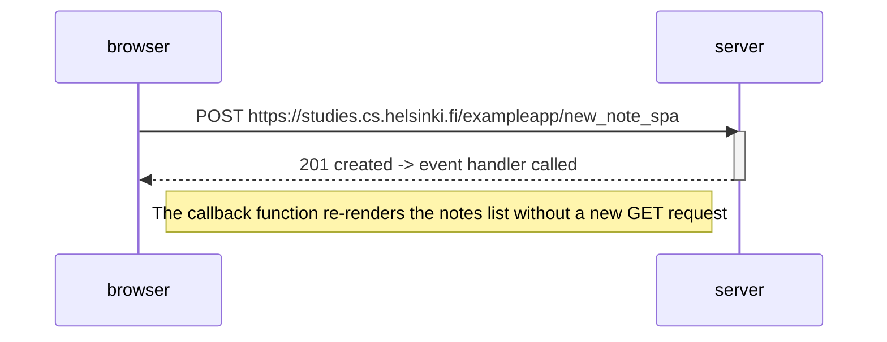

```mermaid

sequenceDiagram
    participant browser
    participant server

    browser->>server: POST https://studies.cs.helsinki.fi/exampleapp/new_note_spa
    activate server
    server-->>browser: 201 created -> event handler called
    deactivate server

    Note right of browser: The callback function re-renders the notes list without a new GET request

```

